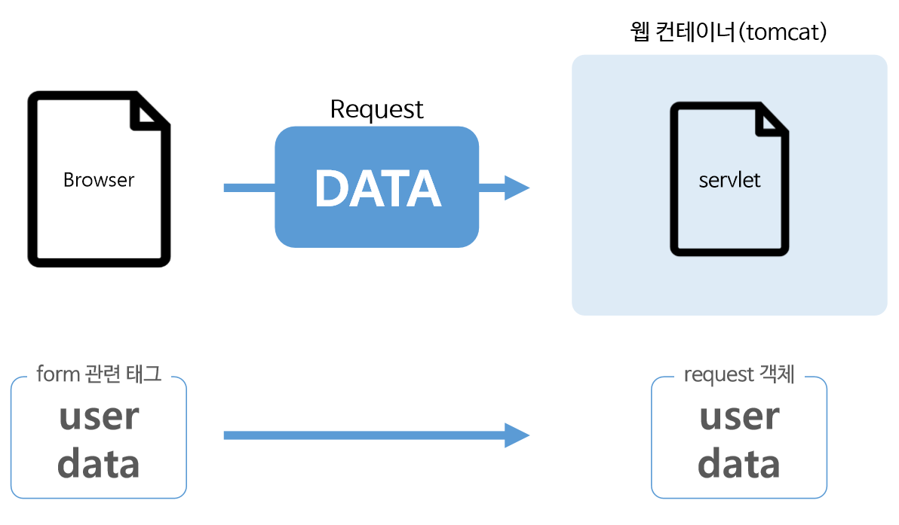
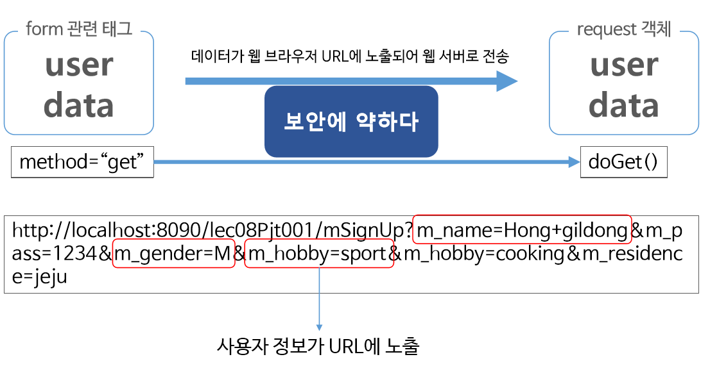
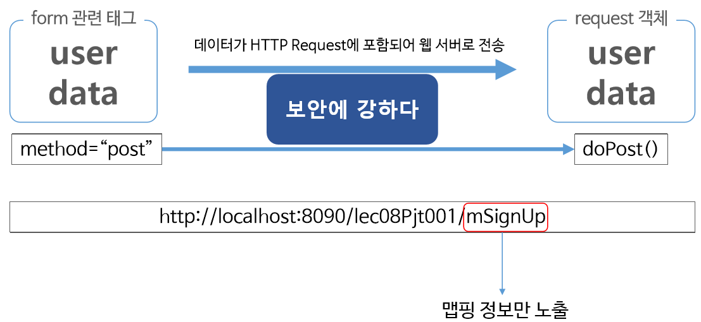

# 2020323
---
# form 태그
~~~
	<form action="" method= "">
	</form>
~~~
 
  
* form 태그는 위와 같은 구성으로 이루어져 있다.
* form태그는 웹페이지에서의 입력양식을 의미한다.
* 로그인 창이나 회원가입 폼등이 해당한다.
* 텍스트 필드에 글자를 입력하거나, 체크박스나 라디오 버튼을 클릭하고 제출버튼을 누르면 백엔드 서버에 양식이 전달되어 정보를 처리하게 된다.
* name : 폼의 이름
* action : 폼의 데이터가 전송되는 백엔드 url
* method : 폼 전송 방식(get/post)

 

## doGet()

* get방식은 클라이언트가 request한 어떤 정보를 가져오는 방식 중 하나이다.
* get방식으로 정보를 전달했을 시에 이를 처리하는 메소드가 바로 doGet()이다.
* 기본값은 get방식으로 되어있다.
* url에 입력한 값들이 그대로 드러나게 되어 보안에 취약하다
* URI에 변수를 포함시켜 요청하게 되기 때문에 길이 제한이 있다.
* 따라서 회원가입이나 로그인하는 폼에 맞지 않다.

 

## doPost()
* 길이 제한이 없어 게시판이나 긴 글을 업로드 하는 형식에 사용될 수 있다.
* ge방식과 달리 URL에 데이터가 노출되지 않는다.
* post방식으로 데이터를 전달하면 URL에 Mapping 정보만 표시된다.
* 따라서 GET방식보다는 보안에 더 좋은 장점을 가지고 있어 개인 정보를 다루는 데이터들을 전달할 때는 POST 방식을 선택하는 것이 바람직하다.

---